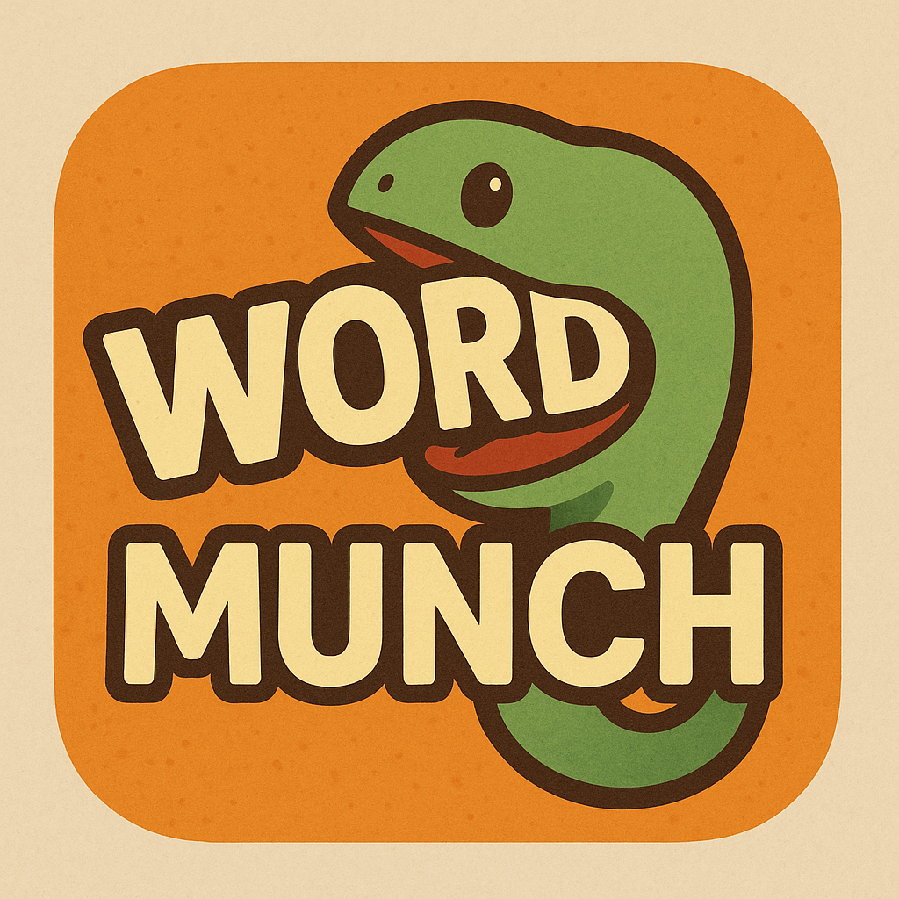
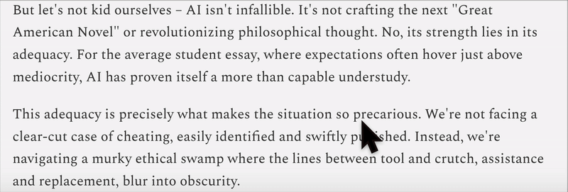

#   Word Munch - Chrome Extension for Simplified 📘Reading Experience

> Word Munch **chunks** dense text, **simplifies** jargon and long sentences, so to **extracts** key ideas and reduce cognitive overload. With reflection **prompts** and logic **diagrams**, it helps users summarize, understand, and retain information— **all within the browser**.

## 🧩 Overview

Have you ever copied a long, complicated paragraph into ChatGPT, just hoping for **some clarity**?

Maybe you’ve hit a wall trying to understand:
- An academic paper full of **jargon**  
- A sentence so long and twisty you forgot how it started  
- Or a paragraph that left you thinking, “Wait… what did I just read?”

**Word Munch** was born from that frustration.

This Chrome Extension helps you read smarter—not harder. It simplifies the way you process online text by giving you **on-the-spot explanations**, **interactive summaries**, and a visual **knowledge map** of what you’re learning.

No more tab-switching, no more cognitive overload. Just click, simplify, and understand—right where you're reading.

## ⚙️ Architecture

- **Frontend**: JavaScript with Chrome Extension (Manifest V3)  
- **Backend**: Node.js microservices in Docker containers  
- **AI API**: Powered by [Ollama API](https://ollama.com)

## ✨ Features



- ### 📚 Vocabulary Simplification Service
  - Click on a word to **trigger a popup**.
  - If it’s a **technical term**, it shows:
    - Concept explanation
    - Example usage
  - If it’s a **general academic word**, it provides a **simplified synonym**.
  - Includes a `Simplify` button to further simplify the term if desired.


- ### 🧾 Sentence Understanding Service
  - Highlight a sentence to activate the service.
  - The backend extracts:
    - Sentence structure
    - Key concepts
    - Example
  - A popup appears with a `Simplify` button to reduce complexity on demand.


- ### 📄 Text Chunking Service 
  - Users read **one paragraph at a time**. Pressing `Enter` prompts them to summarize the paragraph before moving to the next.


- ### 🧠 Paragraph Summarization Service
  - At the **end of each paragraph**, users are asked to summarize what they read, promoting active engagement.


- ### 🧠 Knowledge Graph Service
  - After summarizing a paragraph, a **cell representing the concept** is added to a dynamic **diagram on the right panel**, forming a visual knowledge graph.

  &nbsp;&nbsp;
  
   🍽️ **Chunk reading mode**, along with its summarization and knowledge graph features, is activated by clicking the extension icon. These tools are designed to enhance focus and comprehension while reading complex text.

## 🚀 Getting Started

### Prerequisites

- Node.js
- Docker
- Chrome (for loading the extension in developer mode)
- Ollama

### Installation

1. Clone this repository:
   ```bash
   git clone https://github.com/your-username/word-munch.git
   cd word-munch
   ```

2. Build and run the backend services:
   ```bash
   docker compose up --build
   ```

3. Load the extension in Chrome:
   - Go to `chrome://extensions/`
   - Enable **Developer mode**
   - Click **Load unpacked** and select the `chrome-extension` folder

### Development

- Frontend code is in the `chrome-extension/` folder.
- Backend microservices are in the `services/` folder.

## 📦 Tech Stack

| Layer         | Tech                     |
|---------------|--------------------------|
| Frontend      | JavaScript, Chrome Ext.  |
| Backend       | Node.js, Docker          |
| AI/ML         | Ollama API               |

## 💡 Inspiration

Inspired by the needs of **learners struggling with dense academic text**, Word Munch breaks reading into digestible steps, promoting better **understanding, retention, and vocabulary growth**.
